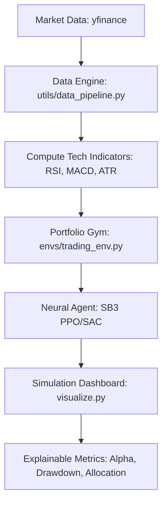

# 📈 APEX RL: Portfolio Optimization & High-Fidelity Market Simulation

[](https://www.python.org/downloads/)
[](https://gymnasium.farama.org/)
[](https://stable-baselines3.readthedocs.io/)
[](https://streamlit.io/)

**APEX RL** is a complete, industrial-grade Reinforcement Learning ecosystem designed for multi-asset portfolio management and quantitative market simulation. Unlike traditional rule-based algorithms, APEX utilizes **Proximal Policy Optimization (PPO)** and **Soft Actor-Critic (SAC)** to discover adaptive trading strategies that account for slippage, transaction costs, and market impact.

---

## 🚀 Key Features

*   **Multi-Asset Simulation**: Simultaneously manages a portfolio of 7+ assets (Stocks, Crypto, Gold, Indices).
*   **High-Fidelity Environment**: Models real-world frictions including **Slippage** and **Turnover-based Transaction Fees**.
*   **Reward Engineering Library**: Benchmarks agents across 5 distinct reward variants (Sharpe, Sortino, Max Drawdown Penalty, etc.).
*   **Premium Dashboard**: Interactive Streamlit-based simulation replay with Alpha tracking and adaptive allocation heatmaps.
*   **Robust Preprocessing**: Integrated Z-Score observation normalization and **Stable Softmax** action mapping to prevent numerical instability.

---

## 🛠️ Architecture Overview



---

## 📦 Quick Start

### 1. Installation
```powershell
git clone https://github.com/44adii/RL-APEX.git
cd RL-APEX
pip install -r requirements.txt
```

### 2. Training
Train an agent with a specific reward variant (e.g., Variant B for Sharpe Ratio):
```powershell
python train.py --steps 100000 --variant B --algo ppo
```

### 3. Simulation Dashboard
Launch the premium interactive replay module:
```powershell
streamlit run visualize.py
```

---

## 📊 The 5 Reward Variants

APEX allows you to benchmark agents trained on different market philosophies:
*   **Variant A**: Raw Return Maximization.
*   **Variant B**: Risk-Adjusted Sharpe Ratio.
*   **Variant C**: Online Differential Sharpe optimization.
*   **Variant D**: Sortino-penalized Downside Protection.
*   **Variant E**: Conservative Max Drawdown mitigation.

---

## 🏆 Backtesting & Results

The system includes a dedicated `evaluate.py` script to benchmark agents against historical baselines:
*   **Buy & Hold**: Market average floor.
*   **Equal Weight**: Fixed rebalancing baseline.

Run evaluation:
```powershell
python evaluate.py
```

---

## 📜 License
This project is licensed under the MIT License - see the LICENSE file for details.

---
